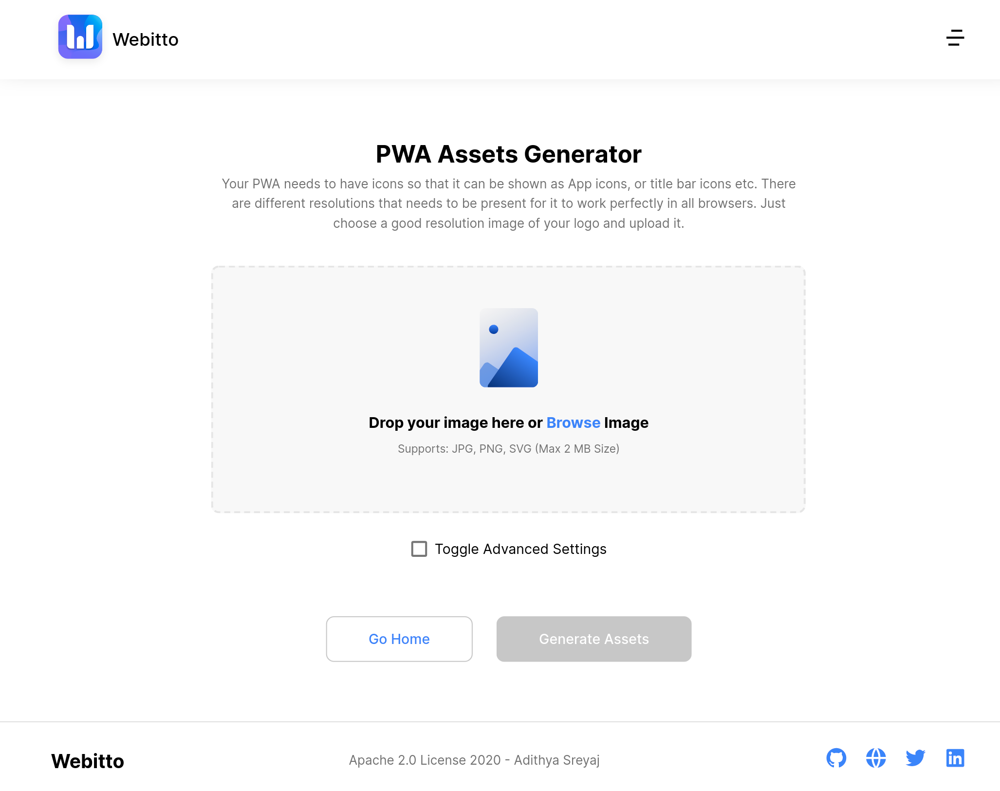

<h1 align="center">Webitto - A bunch of tools to help you redefine the web.</h1>

  
    
  

Webitto is created as a personal project to help me when building websites and web applications. Many a times you will need to generate assets for PWAs, Favicons etc. There are tons of websites out there which can help you with this.

I found many of them very cluttered and not very user friendly. That's when I had the idea to build Webitto.

## 🔥 Features

- PWA Assets generator
- Favicon generator
- Meta Tags Generator
- WebP Converter
- Image Resizer
- Image Optimizer
- SVG Optimizer

At the moment Webitto only has the PWA Assets generator developed. Other are in the pipeline.

## 🤝 Contributing

Contributions, issues and feature requests are welcome. 
Feel free to check [issues page](https://github.com/adisreyaj/webitto-frontend/issues) if you want to contribute.

## Author

👤 **Adithya Sreyaj**

- Twitter: [@AdiSreyaj](https://twitter.com/AdiSreyaj)
- Github: [@adisreyaj](https://github.com/adisreyaj)

## 👍🏼 Show your support

Please ⭐️ this repository if this project helped you!

## 📝 License

Copyright © 2020 [Adithya Sreyaj](https://github.com/adisreyaj). 

This project is [Apache License 2.0](https://github.com/adisreyaj/webitto-frontend/blob/master/LICENSE.md) licensed.
